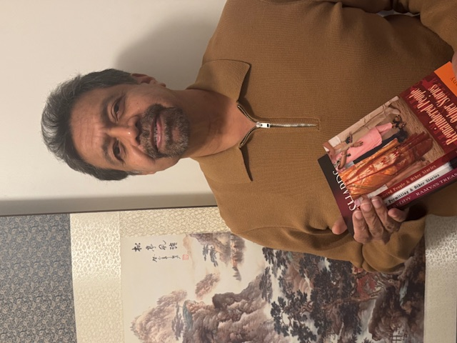

{:style="display:block; margin-left:auto; margin-right:auto"}

Pratap Reddy immigrated to Canada from India in 2002. An alumnus of the Humber School of Writers, he writes poems, short stories, and novels. His work has been published in Canada, the USA, and India. He has written 4 four books: *Weather Permitting and Other Stories* (2016), *Ramya's Treasure* (2018), *Shards of Verse* (2024), and *Remaindered People & Other Stories* (2025). He is currently working on a novel tentatively titled *Praful's Errands* set in India.

He has received awards from the Mississauga Arts Council and grants from the Ontario Arts Council. He serves on the boards of 'Diaspora Dialogues' a nonprofit which encourages new writing and supports emerging writers, and 'The Bootmakers of Toronto' - The Sherlock Holmes Society of Canada.

He lives in Mississauga with his wife and son.
