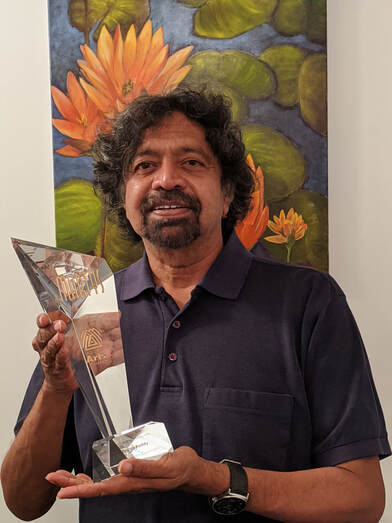

{:style="display:block; margin-left:auto; margin-right:auto"}

Pratap Reddy was born in India, and he moved to Canada in 2002. An underwriter by day, and a writer by night, he writes poems, spoken pieces, and short fiction—mostly about the angst and the agonies (on occasion, the ecstasies) of immigrants from India. 

In 2008, he received the Mississauga Arts Council award for Best Emerging Literary Artist. In 2009, he received a grant from the Ontario Arts Council. His stories have been published in Canada, the United States, and India. In 2018, his novel "Ramya's Treasure" was published by Guernica Editions.
